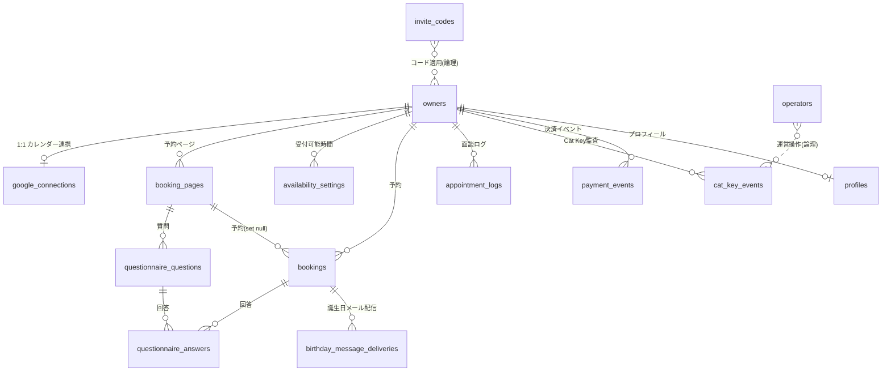

# キマル DB 構成（実装実態）

最終更新: 2026-06-09

実際の定義は [`../supabase-schema.sql`](../supabase-schema.sql)（Supabase / PostgreSQL）。本書はその要約とER図。
仕様上の理想スキーマは [`spec.md`](./spec.md) §15 を参照（本書が**実装の現状**）。

> ⚠️ 実装には歴史的な重複・レガシーが残る（下記「注意点」）。新規実装は **`owners` を主アカウント**として進める。

---

## ER 図（主要リレーション）

> `operators`（運営者）は `owners`（ユーザー）と完全に独立したテーブル。リレーションは監査ログ上の実行者表示など論理的なものに留める。

---

## テーブル一覧

| テーブル | 役割 | 主なカラム |
|---|---|---|
| **owners** | 主アカウント（発行者）。プラン・Cat Key 状態を保持 | `email`(uniq), `name`, `slug`(uniq), `plan`(**free/pro/premium**), `invite_code`, `cat_key_disabled`, `cat_key_pending`, `trial_ends_at`, `password_hash`, `email_verified` |
| **profiles** | プロフィールシート | `owner_id`, `user_id`(legacy), `display_name`, `bio`, `profile_url` |
| **google_connections** | Google カレンダー連携トークン（現行） | `owner_id`(uniq), `calendar_id`, `access_token`, `refresh_token`, `expires_at` |
| **booking_pages** | 予約ページ設定 | `owner_id`, `slug`(uniq), `duration_minutes`(30〜120), `buffer_before/after_minutes`(0〜60), `booking_range_months`(1〜6), `location_type`, `location_value`, `timezone`, `is_active`, `frozen`(降格時凍結・#174) |
| **availability_settings** | 受付可能時間（曜日・時間帯） | `owner_id`, `day_of_week`(0-6), `start_time`, `end_time` |
| **bookings** | 予約 | `owner_id`, `booking_page_id`, `visitor_name/email`, `topic`, `guest_message`(相互質問・#21), `visitor_birth_date`(+`_private`), `relationship_profile`(jsonb), `start_at/end_at`, `meeting_url`, `location_type`, `google_event_id`, `status`。※`birthday_message_opt_in` は廃止機能の遺物（#180） |
| **questionnaire_questions** | 事前アンケート質問 | `booking_page_id`, `question_text`, `is_required`, `sort_order` |
| **questionnaire_answers** | 事前アンケート回答 | `booking_id`, `question_id`, `answer_text` |
| **appointment_logs** | 面談ログ（相手管理） | `owner_id`, `visitor_email`, `keywords`, `notes`, `next_action`, `scores`(jsonb・印象スコア構造化・#175) |
| **ai_assist_logs** | AIアシスト利用ログ（月300回上限の集計元・#190） | `owner_id`, `model`, `prompt_tokens`, `completion_tokens`, `created_at` |
| **email_suppressions** | メール配信停止（解除/バウンス/苦情・#192） | `email`(uniq), `reason`(unsubscribe/bounce/complaint) |
| **thankyou_deliveries** | サンキュー＋登録案内メールの重複防止（#181） | `booking_id`(uniq), `recipient_email`, `status` |
| **birthday_message_deliveries** | 誕生日メール配信記録（重複防止） | `booking_id`, `delivery_date`, `provider_message_id`, `status`, uniq(`booking_id`,`delivery_date`) |
| **invite_codes** | 招待コード（Cat Key）マスタ | `code`(uniq), `plan_grant`(free/pro), `is_active`。初期値 `NEKO20240222`=pro |
| **cat_key_events** | Cat Key 適用・取消・無効の監査 | `owner_id`, `email`, `action`, `code`, `ip_address`, `user_agent`, `metadata`(jsonb) |
| **payment_events** | Square 等の決済イベント記録 | `owner_id`, `provider`, `provider_event_id`, `event_type`, `raw_payload`(jsonb) |
| **operators** | 運営者アカウント（**`owners` とは別管理**）。運営者管理画面（`/operators.html`）で追加・削除・一覧 | `id`, `email`(uniq), `name`, `is_active`, `created_at`、（将来）`password_hash`。※ ログインは `/operator-login.html` → 運営セッション `kimaru_admin_session`（ユーザーと別系統）。認証は当面 共有管理キー `CAT_KEY_ADMIN_SECRET`、本表は運営者ロスター・監査の実行者表示用。将来は運営者ごとのメール+パスワード認証へ |
| **free_signups** | 無料登録フォームの申請 | `name`, `email`, `purpose`, `invite_code`, `language` |
| **users** | ⚠️ レガシーのアカウント表（旧設計） | `email`(uniq), `name`, `plan`, `invite_code` |
| **google_calendar_tokens** | ⚠️ レガシーのトークン表（旧設計） | `user_id`/`owner_id`, `access_token`, `refresh_token`, `expiry_date` |

---

## アクター別の利用テーブル

- **発行者ユーザー**: `owners`（自分）, `profiles`, `google_connections`, `booking_pages`, `availability_settings`, `questionnaire_questions`, `bookings`(自分宛), `appointment_logs`。
- **ゲスト**: `bookings`（作成）, `questionnaire_answers`（作成）。ログイン不要なので自身のレコードは持たない。
- **運営者**: `operators`（自身の運営アカウント・運営者管理）, `owners`（一覧・plan操作）, `invite_codes`, `cat_key_events`, `payment_events`。運営者は `owners`（ユーザー）とは別アカウントとして `operators` に持つ。

---

## 注意点（実装の重複・レガシー）

実装が段階的に育ったため、以下の重複が残る。**整理方針（#25・2026-06-09）＝ 破壊的 DROP はしない（誤削除・既存データ消失リスク回避）。`supabase-schema.sql` に `⚠️ LEGACY` 注記を付け、コードは現行カラムのみ参照する**（本書＋スキーマ本体のコメントで明示）。

1. **`owners` vs `users`**: 現行の主アカウントは **`owners`**。`users` は旧設計のレガシーで、各表に `user_id` 列が残るが新規では `owner_id` を使う。
2. **`google_connections` vs `google_calendar_tokens`**: カレンダー連携は現行 **`google_connections`**。`google_calendar_tokens` はレガシー。
3. **`bookings` の重複カラム**:
   - 来訪者名: `visitor_name`/`visitor_email`（現行）と `guest_name`/`guest_email`（旧）。
   - 時刻: `start_at`/`end_at`（現行）と `start_time`/`end_time`（旧）。
4. **`booking_pages` の `active` と `is_active`**: 両方存在。現行は `is_active`。
5. これらは `supabase-schema.sql` 末尾の `alter table ... add column if not exists` で後付けされた経緯がある。各レガシー定義の直前に `⚠️ LEGACY（#25）` コメントを付与済み。

## 打ち合わせ反映に伴うスキーマ変更（進捗）

- ✅ **複数の予約ページ**（[features/24](./features/24-multiple-booking-pages.md)）: `slug` グローバル一意維持・オーナー複数行・保存数上限（無料2/Pro5、frozen は上限カウント除外・#174）。
- ✅ **受付期間 無料2ヶ月化**（[features/05](./features/05-booking-range.md)）: `booking_range_months` CHECK は `(1〜6)`、無料は2ヶ月にクランプ。
- ✅ **会員同士の相互質問**（[features/20](./features/20-member-mutual-questions.md)）: `bookings.guest_message`（最小実装・#21）。本格的な相互アンケート交換は将来。
- ✅ **議事録連携**（[features/23](./features/23-meeting-minutes.md)）: 汎用 inbound webhook（`meeting-notes-webhook`）→ `appointment_logs` 保存（#24・env-gate）。専用議事録テーブルは将来。
- ✅ **お試し期間**（[features/13](./features/13-plans.md)）: `owners.trial_ends_at`。Pro=1ヶ月無料、プレミアム=無料お試しなし。
- ✅ **印象スコア構造化**（[features/14](./features/14-customer-management.md)）: `appointment_logs.scores`(jsonb)＋相手ごと集約ビュー（#175）。
- ✅ **プレミアムプラン**（決定20）: `owners.plan` に `premium`、AIアシスト利用ログ `ai_assist_logs`（月300回上限）。
- ✅ **メール送信基盤**（決定13）: `email_suppressions`（配信停止）、`thankyou_deliveries`（重複防止）。
- ✅ **認証**（決定3）: `owners.password_hash` / `owners.email_verified`（メール確認は任意・非ブロッキング・#73）。
- 🔜 **事前アンケート選択式**（[features/10](./features/10-questionnaire.md)）: `questionnaire_questions` に回答形式・選択肢カラム。
- 🔜 **高度プロフィールの画像**（[features/17](./features/17-profile.md)）: 画像保存先（Supabase Storage 等）が未決のため見送り（#176はテキスト装飾＋公開ページのみ実装）。
- 🔜 **算命学の日柱精密化**（[features/16](./features/16-birthday.md)）: 現状は年柱五行＋数秘ライフパス（#20）。日柱は暦データが必要。
- **運営者の分離**（[features/22](./features/22-admin-console.md)、決定 2026-06-04）: 運営者を `owners` と別テーブル `operators`（`email` uniq, `name`, `is_active`、将来 `password_hash`）で管理。運営ログイン `/operator-login.html` ＋ **運営専用セッション `kimaru_admin_session`**（ユーザーの `kimaru_session` と別系統）を新設。運営者管理（一覧/追加/削除）UI・API を追加。認証は共有管理キー `CAT_KEY_ADMIN_SECRET` を継続（将来 運営者ごとのメール+パスワードへ）。
